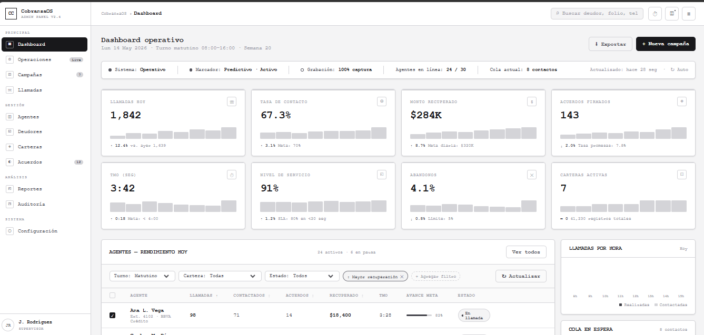

# CobranzaOS — Admin Dashboard

Dashboard administrativo para gestión de operaciones de cobranza, diseñado con una interfaz limpia, moderna y enfocada en métricas operativas en tiempo real.

---
## Vistas

---
## Descripción

CobranzaOS Admin Dashboard es una interfaz web construida en HTML y CSS puro que permite visualizar:

- Rendimiento de agentes
- Métricas clave de operación
- Estado del sistema en tiempo real
- Gestión de campañas y cartera
- Cola de contactos en espera

---

## Características principales

- Sidebar de navegación estructurada  
- Topbar con búsqueda y acciones rápidas  
- Dashboard con métricas en tiempo real  
- Tabla de agentes con filtros y ordenamiento  
- Indicadores visuales (badges, progress bars, sparklines)  
- Paneles laterales con información operativa  

---

## Tecnologías utilizadas

- HTML5
- CSS3 (variables personalizadas)
- Diseño UI sin frameworks

---

## Estructura del proyecto

📦 cobranza-dashboard  
 ┣ 📄 index.html  
 ┗ 📄 README.md  

---

## Cómo usar

1. Clona el repositorio:

git clone https://github.com/Joana2406/wireframe-dashboard-web.git

2. Abre el archivo index.html en tu navegador.

---

## Módulos incluidos

### Métricas
- Llamadas realizadas
- Tasa de contacto
- Monto recuperado
- Acuerdos firmados
- TMO
- Nivel de servicio
- Abandonos
- Carteras activas

### Gestión de agentes
Tabla con métricas de desempeño, filtros y acciones.

### Operación en tiempo real
- Estado del sistema
- Agentes en línea
- Cola de contactos

---

## Responsividad

Adaptable a pantallas medianas y pequeñas mediante CSS Grid.

---

## Personalización

Puedes modificar colores, layout y datos directamente desde el HTML y variables CSS.

---

## Mejoras futuras

- Integración con backend
- Datos dinámicos
- Autenticación
- Dark mode
- Gráficas avanzadas

---

## Licencia

Uso libre para fines educativos y proyectos personales.
